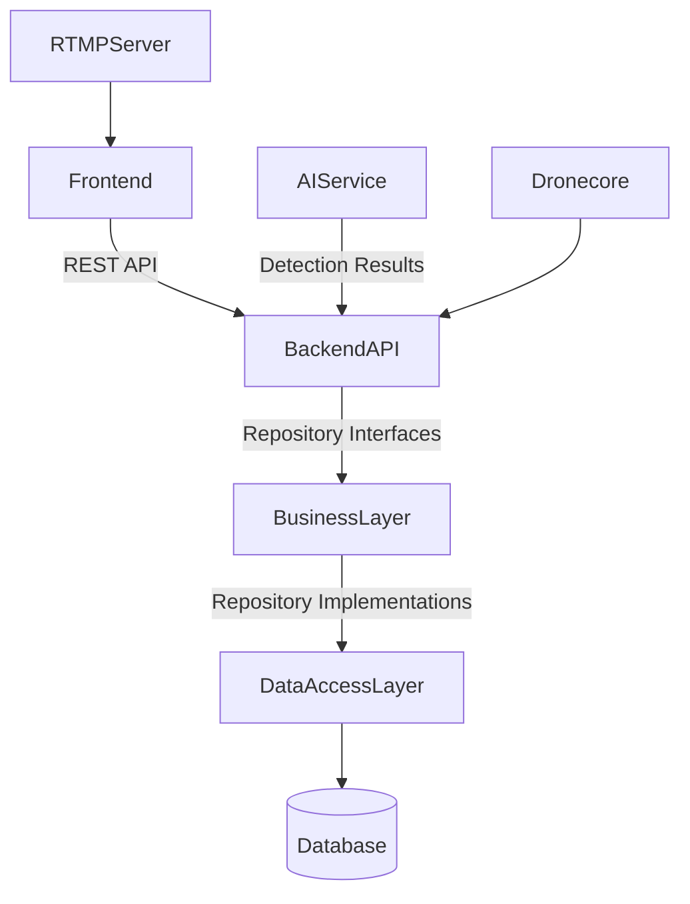

# Bulo.Cloud Sentinel - Technical Documentation

## Overview

Bulo.Cloud Sentinel is a modular, scalable, and secure cloud-based system designed for real-time video streaming, AI-based object detection, and alerting. The system is architected following enterprise-grade principles emphasizing clean architecture, separation of concerns, dependency inversion, and externalized configuration.

This document provides a comprehensive technical overview of the system architecture, components, interfaces, security considerations, configuration management, deployment, and testing strategies.

---

## Architecture

### Layered Architecture

The system is divided into the following layers:

- **Presentation Layer (Frontend):** React-based SPA using Tailwind CSS for styling, responsible for user interaction, authentication, and real-time video display.

- **API Layer (Backend):** FastAPI-based RESTful API exposing endpoints for setup, authentication, user info, and detections. Implements JWT authentication and input validation.

- **Business Layer (Domain & Application):** Encapsulates domain entities, value objects, business rules, and services. Implements use cases and coordinates data access.

- **Data Access Layer:** Abstracted repository interfaces with SQLAlchemy ORM implementations for persistence. Ensures decoupling of business logic from database specifics.

- **Infrastructure Layer:** Manages configuration, database connections, security utilities, and external integrations.

- **AI Detection Service:** Containerized Python service processing real-time video streams using YOLOv8, sending detection results to backend API.

- **RTMP Server:** Nginx-based RTMP server with HLS support for video streaming ingestion and distribution.

- **Dronecore Module:** Modular drone control system integrating PX4, ArduPilot, Betaflight, SITL simulators, and FPV video streaming.

### Component Diagram

---

## Backend Detailed Design

### Domain Model

- **User Entity:** Immutable dataclass representing user with id, username, email, hashed password, active status, and superuser flag.

- **Value Objects:** Email class with validation ensuring correct email format.

### Repository Pattern

- **IUserRepository:** Abstract interface defining async methods for CRUD operations on User entities.

- **SqlAlchemyUserRepository:** Concrete implementation using SQLAlchemy async ORM.

### Business Services

- **UserService:** Implements user registration, authentication, and retrieval using IUserRepository. Passwords verified with bcrypt.

- **AuthService:** Handles password hashing, verification, and JWT token creation.

### API Layer

- **Endpoints:**
  - `/api/setup`: Initializes database schema.
  - `/api/login`: Authenticates user, returns JWT token.
  - `/api/me`: Returns current user info based on JWT.
  - `/api/detections`: Placeholder for detection data retrieval.

- **Security:** JWT tokens signed with secret and HS256 algorithm, expiration configurable.

- **Dependency Injection:** FastAPI dependencies provide repository instances.

### Configuration

- Managed via Pydantic BaseSettings with environment variable overrides.

- Validates database URL format and JWT settings.

---

## Frontend Detailed Design

- React SPA bootstrapped with Create React App.

- Tailwind CSS for responsive and dark mode styling.

- JWT authentication with token stored in localStorage.

- Protected routes redirect unauthenticated users to login.

- Real-time video streaming embedded via ReactPlayer consuming HLS stream from RTMP server.

- Alerts and logs section prepared for dynamic updates via WebSocket or polling.

---

## AI Detection Service

- Python container running YOLOv8 or similar model.

- Processes RTMP/HLS video streams in real-time.

- Sends detection results asynchronously to backend API.

- Designed for scalability and GPU acceleration.

---

## RTMP Server

- Nginx with RTMP module configured for stream ingestion.

- Supports stream key authentication and HLS transcoding.

- Serves HLS streams to frontend clients.

---

## Dronecore Module

- **FlightControllerAdapter:** Interface defining flight controller communication.

- **PX4Adapter, ArduPilotAdapter, BetaflightAdapter:** Implementations for popular autopilot stacks.

- **MAVLinkClient:** Asynchronous MAVLink protocol client.

- **DroneTelemetryService:** Manages telemetry subscriptions and notifications.

- **DroneMissionPlanner:** Mission waypoint management.

- **FailsafeManager:** Emergency fallback handling.

- **SITLSimulationBridge:** Simulator integration.

- **FPVVideoStream:** Placeholder for FPV video decoding.

---

## Security Considerations

- Passwords hashed with bcrypt.

- JWT tokens with expiration and secure signing.

- Input validation with Pydantic.

- Externalized secrets via environment variables.

- Recommendations for rate limiting, brute force protection, CORS, and security headers.

---

## Configuration Management

- Hierarchical configuration with defaults, environment-specific, and instance-specific overrides.

- Validation at startup to fail fast on invalid config.

- Sensitive data managed via environment variables.

---

## Testing Strategy

- Unit tests for domain entities, services, and repositories.

- Integration tests for API endpoints and database interactions.

- E2E tests for frontend user flows.

- Performance and security testing recommended.

- SITL-based test suite and fake telemetry generators for dronecore.

---

## Deployment

- Dockerfiles for all components with multi-stage builds.

- Docker Compose orchestration for local and production-like environments.

- Environment variables externalized and documented in `.env.example`.

- Recommendations for CI/CD integration and monitoring.

---

## Future Enhancements

- Implement rate limiting and security middleware.

- Add comprehensive logging and monitoring.

- Expand AI detection capabilities and alerting.

- Integrate cloud storage and advanced AI optimizations.

- Implement Telegram alerts and geospatial mapping.

- Extend dronecore with additional autopilot adapters and FPV video processing.

---

## Contact and Contribution

For questions or contributions, please contact the development team or submit issues and pull requests via the GitHub repository.

---

*This documentation is generated to provide a detailed technical overview for developers and architects working on the Bulo.Cloud Sentinel system.*
