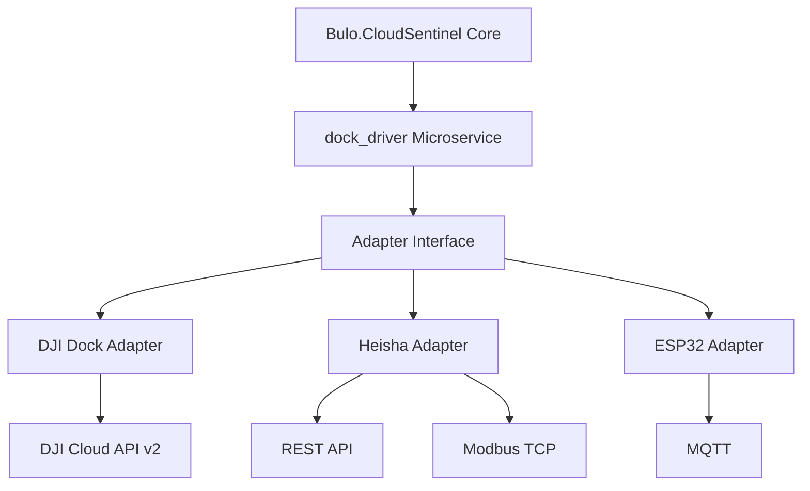

# Dock Stations Integration

This document provides comprehensive information about the Dock Stations integration in Bulo.CloudSentinel. The dock_driver microservice enables seamless integration with various drone docking stations, allowing for automated charging, protection from weather, and extended operational capabilities.

## Overview

The Dock Stations integration supports three types of docking stations:

1. **DJI Dock 2** - Commercial solution using DJI Cloud API v2
2. **Heisha Charging Pad** - Third-party charging pad using REST API and Modbus TCP
3. **DIY ESP32-powered Dock** - Custom solution using ESPHome with MQTT

The integration provides a unified interface for controlling and monitoring these docking stations, regardless of the underlying hardware and communication protocols.

## Architecture

The Dock Stations integration is implemented as a microservice that follows the adapter pattern:



The microservice exposes a REST API that allows the core Bulo.CloudSentinel platform to interact with the docking stations. The API provides endpoints for:

- Getting dock status
- Opening/closing the dock
- Initiating charging
- Retrieving charging status
- Controlling environmental systems (fans, heaters)
- Retrieving telemetry data

## DJI Dock 2 Integration

### Overview

The DJI Dock 2 is a commercial docking station that provides automated charging, protection from weather, and remote operation capabilities. It is integrated with Bulo.CloudSentinel using the DJI Cloud API v2.

### Configuration

To configure the DJI Dock 2 integration, you need to provide the following parameters in the `config.yaml` file:

```yaml
dji_dock:
  enabled: true
  api_key: "your-dji-cloud-api-key"
  api_secret: "your-dji-cloud-api-secret"
  dock_sn: "dock-serial-number"
  region: "us-east-1"  # Available regions: us-east-1, eu-central-1, ap-southeast-1
  refresh_interval: 30  # Seconds
```

### API Endpoints

The DJI Dock 2 adapter provides the following API endpoints:

- `GET /api/docks/dji/{dock_id}/status` - Get dock status
- `POST /api/docks/dji/{dock_id}/open` - Open the dock
- `POST /api/docks/dji/{dock_id}/close` - Close the dock
- `POST /api/docks/dji/{dock_id}/charge/start` - Start charging
- `POST /api/docks/dji/{dock_id}/charge/stop` - Stop charging
- `GET /api/docks/dji/{dock_id}/telemetry` - Get telemetry data

### Authentication

The DJI Cloud API v2 uses OAuth 2.0 for authentication. The dock_driver microservice handles the authentication process automatically using the provided API key and secret.

## Heisha Charging Pad Integration

### Overview

The Heisha Charging Pad is a third-party charging solution that provides automated charging for drones. It is integrated with Bulo.CloudSentinel using a combination of REST API and Modbus TCP.

### Configuration

To configure the Heisha Charging Pad integration, you need to provide the following parameters in the `config.yaml` file:

```yaml
heisha_dock:
  enabled: true
  rest_api_url: "http://heisha-dock-ip:8080/api"
  modbus_host: "heisha-dock-ip"
  modbus_port: 502
  modbus_unit_id: 1
  refresh_interval: 15  # Seconds
  username: "admin"  # Optional, for REST API authentication
  password: "password"  # Optional, for REST API authentication
```

### API Endpoints

The Heisha Charging Pad adapter provides the following API endpoints:

- `GET /api/docks/heisha/{dock_id}/status` - Get dock status
- `POST /api/docks/heisha/{dock_id}/open` - Open the dock
- `POST /api/docks/heisha/{dock_id}/close` - Close the dock
- `POST /api/docks/heisha/{dock_id}/charge/start` - Start charging
- `POST /api/docks/heisha/{dock_id}/charge/stop` - Stop charging
- `GET /api/docks/heisha/{dock_id}/telemetry` - Get telemetry data
- `POST /api/docks/heisha/{dock_id}/fan/{speed}` - Set fan speed (0-100%)
- `POST /api/docks/heisha/{dock_id}/heater/{state}` - Set heater state (on/off)

### Modbus Register Map

The Heisha Charging Pad uses Modbus TCP for low-level control and monitoring. The following register map is used:

| Register | Description | Data Type | Access |
|----------|-------------|-----------|--------|
| 0 | Dock Status | UINT16 | Read |
| 1 | Charging Status | UINT16 | Read |
| 2 | Battery Level | UINT16 | Read |
| 3 | Charging Current | UINT16 | Read |
| 4 | Charging Voltage | UINT16 | Read |
| 5 | Temperature | INT16 | Read |
| 6 | Humidity | UINT16 | Read |
| 7 | Fan Speed | UINT16 | Read/Write |
| 8 | Heater Status | UINT16 | Read/Write |
| 9 | Dock Control | UINT16 | Write |
| 10 | Charging Control | UINT16 | Write |

## DIY ESP32-powered Dock Integration

### Overview

The DIY ESP32-powered Dock is a custom solution that provides basic charging capabilities using ESPHome with MQTT for communication. It is designed to be a cost-effective alternative to commercial solutions.

### Configuration

To configure the DIY ESP32-powered Dock integration, you need to provide the following parameters in the `config.yaml` file:

```yaml
esp32_dock:
  enabled: true
  mqtt_broker: "mqtt-broker-ip"
  mqtt_port: 1883
  mqtt_username: "username"  # Optional
  mqtt_password: "password"  # Optional
  mqtt_topic_prefix: "esp32_dock"
  refresh_interval: 10  # Seconds
```

### API Endpoints

The DIY ESP32-powered Dock adapter provides the following API endpoints:

- `GET /api/docks/esp32/{dock_id}/status` - Get dock status
- `POST /api/docks/esp32/{dock_id}/relay/{state}` - Set charging relay state (on/off)
- `GET /api/docks/esp32/{dock_id}/telemetry` - Get telemetry data

### MQTT Topics

The DIY ESP32-powered Dock uses the following MQTT topics for communication:

| Topic | Description | Direction |
|-------|-------------|-----------|
| `{prefix}/{dock_id}/status` | Dock status | Subscribe |
| `{prefix}/{dock_id}/voltage` | Charging voltage | Subscribe |
| `{prefix}/{dock_id}/current` | Charging current | Subscribe |
| `{prefix}/{dock_id}/temperature` | Temperature | Subscribe |
| `{prefix}/{dock_id}/relay/set` | Set charging relay state | Publish |
| `{prefix}/{dock_id}/available` | Dock availability | Subscribe |

## Security Considerations

The Dock Stations integration implements several security measures to ensure secure operation:

1. **Authentication** - All API endpoints require authentication using JWT tokens.
2. **Encryption** - All communication with the docking stations is encrypted using TLS/SSL.
3. **Input Validation** - All input parameters are validated to prevent injection attacks.
4. **Rate Limiting** - API endpoints are rate-limited to prevent abuse.
5. **Audit Logging** - All actions are logged for audit purposes.

## Integration with Power Management

The Dock Stations integration is tightly integrated with the Power Management module to enable automated charging when the battery level is low. The integration works as follows:

1. The Power Management module monitors the battery level of the drone.
2. When the battery level drops below a configurable threshold, the Power Management module triggers a return-to-home (RTH) operation.
3. Once the drone is near the docking station, the Dock Stations module takes over and guides the drone to the docking station.
4. The docking station charges the drone until the battery level reaches a configurable threshold.
5. Once charging is complete, the drone can resume its mission or remain docked until needed.

## Troubleshooting

### Common Issues

- **Connection Errors** - Ensure that the docking station is powered on and connected to the network.
- **Authentication Errors** - Verify that the API key, username, and password are correct.
- **Timeout Errors** - Check network connectivity and increase timeout values if necessary.
- **Protocol Errors** - Ensure that the docking station firmware is up to date.

### Logs

The dock_driver microservice logs all actions and errors to the standard output and to a log file. The log level can be configured in the `config.yaml` file:

```yaml
logging:
  level: INFO  # Available levels: DEBUG, INFO, WARNING, ERROR, CRITICAL
  file: "/var/log/dock_driver.log"
```

## References

- [DJI Cloud API Documentation](https://developer.dji.com/document/cloud-api-tutorial/overview)
- [Heisha Charging Pad Documentation](https://www.heishatech.com/download/DNEST-Technical-Documentation.pdf)
- [ESPHome Documentation](https://esphome.io/index.html)
- [Modbus Protocol Specification](https://modbus.org/docs/Modbus_Application_Protocol_V1_1b.pdf)
