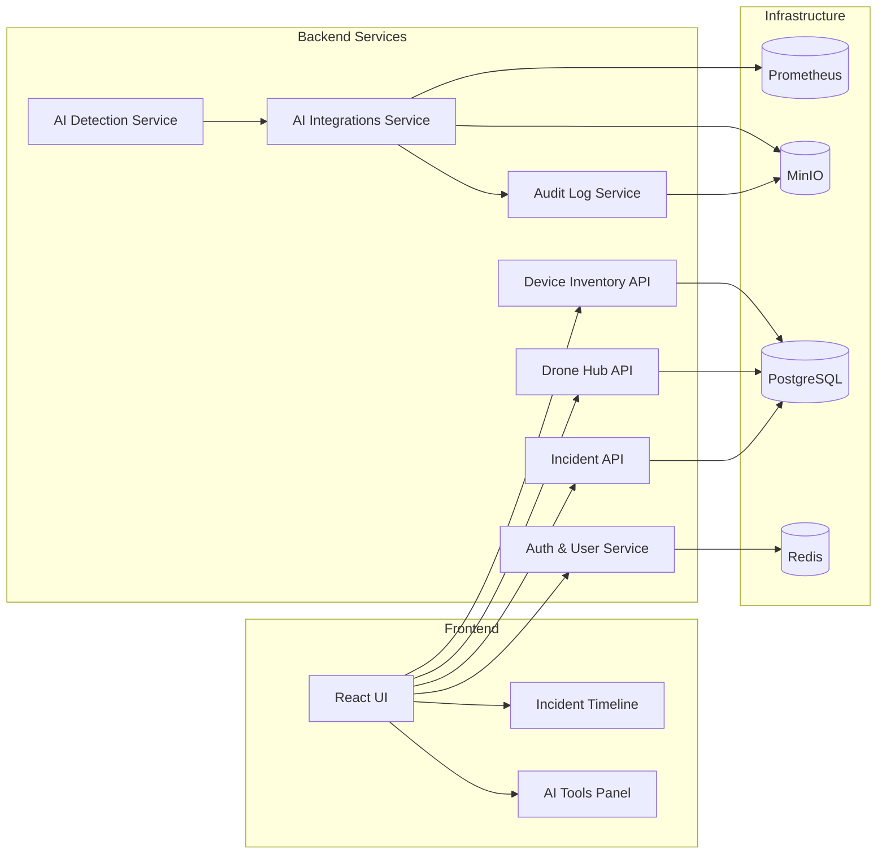

# Architecture Overview

Bulo.Cloud Sentinel is designed as a set of microservices that communicate over REST APIs and event streams, offering modularity and independent scaling.

- **Frontend** handles all user interactions and renders UI components.
- **Backend Services** are independent FastAPI containers, each responsible for a specific domain.
- **AI Detection** uses custom ML models for inference.
- **AI Integrations** proxies to external AI APIs via adapter classes.
- **Audit Log** persists request/response metadata for compliance.
- **Infrastructure** components provide data persistence and observability.
