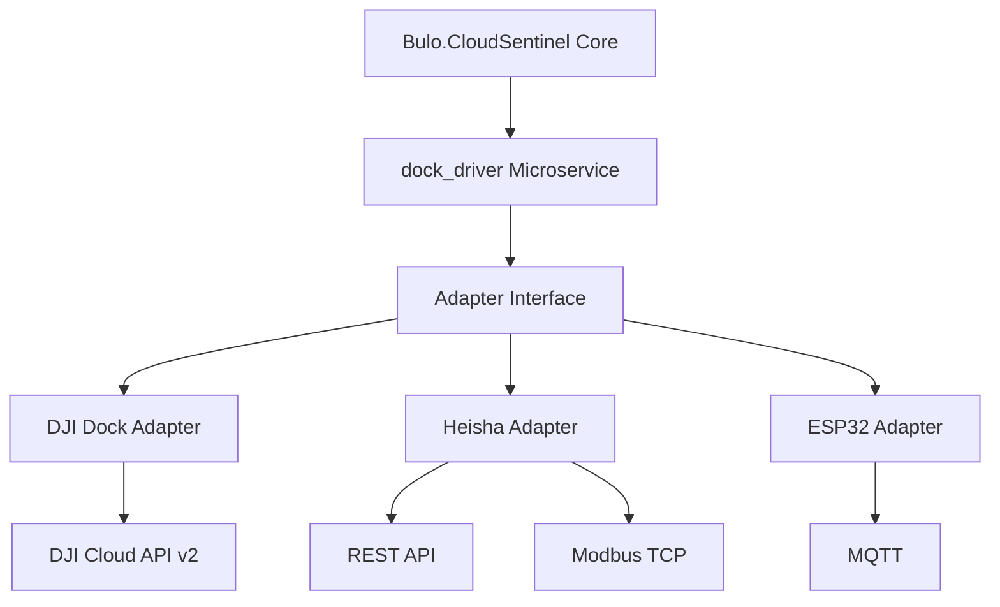

# Dock Stations

This wiki page provides comprehensive information about the Dock Stations feature in Bulo.CloudSentinel.

## Overview

The Dock Stations feature enables seamless integration with various drone docking stations, allowing for automated charging, protection from weather, and extended operational capabilities. The feature is implemented as a microservice that follows the adapter pattern, providing a unified interface for controlling and monitoring different types of docking stations.

## Supported Dock Types

The Dock Stations feature supports the following types of docking stations:

### DJI Dock 2

The DJI Dock 2 is a commercial docking station that provides automated charging, protection from weather, and remote operation capabilities. It is integrated with Bulo.CloudSentinel using the DJI Cloud API v2.

Key features:
- Automated charging
- Weather protection
- Remote operation
- Telemetry data collection
- Integration with DJI Cloud API v2

### Heisha Charging Pad

The Heisha Charging Pad is a third-party charging solution that provides automated charging for drones. It is integrated with Bulo.CloudSentinel using a combination of REST API and Modbus TCP.

Key features:
- Automated charging
- Environmental control (fan, heater)
- Telemetry data collection
- Integration with REST API and Modbus TCP

### DIY ESP32-powered Dock

The DIY ESP32-powered Dock is a custom solution that provides basic charging capabilities using ESPHome with MQTT for communication. It is designed to be a cost-effective alternative to commercial solutions.

Key features:
- Basic charging capabilities
- Telemetry data collection
- Integration with MQTT
- Cost-effective solution

## Architecture

The Dock Stations feature is implemented as a microservice that follows the adapter pattern:



The microservice exposes a REST API that allows the core Bulo.CloudSentinel platform to interact with the docking stations. The API provides endpoints for:

- Getting dock status
- Opening/closing the dock
- Initiating charging
- Retrieving charging status
- Controlling environmental systems (fans, heaters)
- Retrieving telemetry data

## Integration with Power Management

The Dock Stations feature is tightly integrated with the Power Management module to enable automated charging when the battery level is low. The integration works as follows:

1. The Power Management module monitors the battery level of the drone.
2. When the battery level drops below a configurable threshold, the Power Management module triggers a return-to-home (RTH) operation.
3. Once the drone is near the docking station, the Dock Stations module takes over and guides the drone to the docking station.
4. The docking station charges the drone until the battery level reaches a configurable threshold.
5. Once charging is complete, the drone can resume its mission or remain docked until needed.

## Installation and Configuration

### Docker Installation

To install the Dock Stations microservice using Docker, follow these steps:

1. Clone the repository:
   ```bash
   git clone https://github.com/BuloZB/BuloCloudSentinel.git
   cd BuloCloudSentinel/dock_driver
   ```

2. Configure the microservice by editing the `config/config.yaml` file:
   ```yaml
   server:
     host: "0.0.0.0"
     port: 8060
     debug: false

   security:
     jwt_secret: "your-jwt-secret"
     jwt_algorithm: "HS256"
     jwt_expiration: 3600  # Seconds

   dji_dock:
     enabled: true
     api_key: "your-dji-cloud-api-key"
     api_secret: "your-dji-cloud-api-secret"
     dock_sn: "dock-serial-number"
     region: "us-east-1"  # Available regions: us-east-1, eu-central-1, ap-southeast-1
     refresh_interval: 30  # Seconds

   heisha_dock:
     enabled: true
     rest_api_url: "http://heisha-dock-ip:8080/api"
     modbus_host: "heisha-dock-ip"
     modbus_port: 502
     modbus_unit_id: 1
     refresh_interval: 15  # Seconds
     username: "admin"  # Optional, for REST API authentication
     password: "password"  # Optional, for REST API authentication

   esp32_dock:
     enabled: true
     mqtt_broker: "mqtt-broker-ip"
     mqtt_port: 1883
     mqtt_username: "username"  # Optional
     mqtt_password: "password"  # Optional
     mqtt_topic_prefix: "esp32_dock"
     refresh_interval: 10  # Seconds

   power_management:
     integration_enabled: true
     api_url: "http://bulocloud-sentinel-api:8000/api/power-management"
     auto_charge_threshold: 30  # Percentage
     charge_complete_threshold: 90  # Percentage

   redis:
     url: "redis://redis:6379/0"
     prefix: "dock_driver:"
     ttl: 3600  # Seconds

   logging:
     level: "INFO"
     file: "/var/log/dock_driver.log"
     max_size: 10  # MB
     backup_count: 5
   ```

3. Build and run the Docker container:
   ```bash
   docker-compose up -d
   ```

### Kubernetes Installation

To install the Dock Stations microservice using Kubernetes, follow these steps:

1. Clone the repository:
   ```bash
   git clone https://github.com/BuloZB/BuloCloudSentinel.git
   cd BuloCloudSentinel/dock_driver
   ```

2. Create a Kubernetes namespace:
   ```bash
   kubectl create namespace bulocloud-sentinel
   ```

3. Create a Kubernetes secret for sensitive information:
   ```bash
   kubectl create secret generic dock-driver-secrets \
     --namespace bulocloud-sentinel \
     --from-literal=jwt-secret=your-jwt-secret \
     --from-literal=dji-api-key=your-dji-cloud-api-key \
     --from-literal=dji-api-secret=your-dji-cloud-api-secret \
     --from-literal=dji-dock-sn=dock-serial-number \
     --from-literal=heisha-username=admin \
     --from-literal=heisha-password=password \
     --from-literal=mqtt-username=username \
     --from-literal=mqtt-password=password \
     --from-literal=power-management-jwt-token=your-jwt-token
   ```

4. Apply the Kubernetes manifests:
   ```bash
   kubectl apply -f kubernetes/deployment.yaml
   ```

### Helm Installation

To install the Dock Stations microservice using Helm, follow these steps:

1. Clone the repository:
   ```bash
   git clone https://github.com/BuloZB/BuloCloudSentinel.git
   cd BuloCloudSentinel/dock_driver
   ```

2. Create a Kubernetes namespace:
   ```bash
   kubectl create namespace bulocloud-sentinel
   ```

3. Install the Helm chart:
   ```bash
   helm install dock-driver kubernetes/helm \
     --namespace bulocloud-sentinel \
     --set secrets.jwt_secret=your-jwt-secret \
     --set secrets.dji_api_key=your-dji-cloud-api-key \
     --set secrets.dji_api_secret=your-dji-cloud-api-secret \
     --set secrets.dji_dock_sn=dock-serial-number \
     --set secrets.heisha_username=admin \
     --set secrets.heisha_password=password \
     --set secrets.mqtt_username=username \
     --set secrets.mqtt_password=password \
     --set secrets.power_management_jwt_token=your-jwt-token \
     --set env.heisha_dock_ip=heisha-dock-ip \
     --set env.mqtt_broker=mqtt-broker-ip
   ```

## API Usage

The Dock Stations microservice exposes a REST API for controlling and monitoring docking stations. For detailed information about the API endpoints, see the [API Documentation](../dock_driver/docs/api.md).

### Authentication

To authenticate with the API, send a POST request to the `/token` endpoint with your username and password:

```bash
curl -X POST http://dock-driver:8060/token \
  -H "Content-Type: application/x-www-form-urlencoded" \
  -d "username=admin&password=admin"
```

This will return a JWT token that you can use to authenticate subsequent requests:

```json
{
  "access_token": "your-jwt-token",
  "token_type": "bearer",
  "expires_in": 3600
}
```

### Getting Dock Status

To get the status of a dock, send a GET request to the `/api/docks/{dock_type}/{dock_id}/status` endpoint:

```bash
curl -X GET http://dock-driver:8060/api/docks/dji/dji-dock-1/status \
  -H "Authorization: Bearer your-jwt-token"
```

### Starting Charging

To start charging a drone, send a POST request to the `/api/docks/{dock_type}/{dock_id}/charge/start` endpoint:

```bash
curl -X POST http://dock-driver:8060/api/docks/dji/dji-dock-1/charge/start \
  -H "Authorization: Bearer your-jwt-token"
```

## Troubleshooting

### Common Issues

- **Connection Errors**: Ensure that the docking station is powered on and connected to the network.
- **Authentication Errors**: Verify that the API key, username, and password are correct.
- **Timeout Errors**: Check network connectivity and increase timeout values if necessary.
- **Protocol Errors**: Ensure that the docking station firmware is up to date.

### Logs

The dock_driver microservice logs all actions and errors to the standard output and to a log file. The log level can be configured in the `config.yaml` file:

```yaml
logging:
  level: INFO  # Available levels: DEBUG, INFO, WARNING, ERROR, CRITICAL
  file: "/var/log/dock_driver.log"
```

To view the logs in a Docker container:

```bash
docker logs dock-driver
```

To view the logs in a Kubernetes pod:

```bash
kubectl logs -f deployment/dock-driver -n bulocloud-sentinel
```

## References

- [DJI Cloud API Documentation](https://developer.dji.com/document/cloud-api-tutorial/overview)
- [Heisha Charging Pad Documentation](https://www.heishatech.com/download/DNEST-Technical-Documentation.pdf)
- [ESPHome Documentation](https://esphome.io/index.html)
- [Modbus Protocol Specification](https://modbus.org/docs/Modbus_Application_Protocol_V1_1b.pdf)
