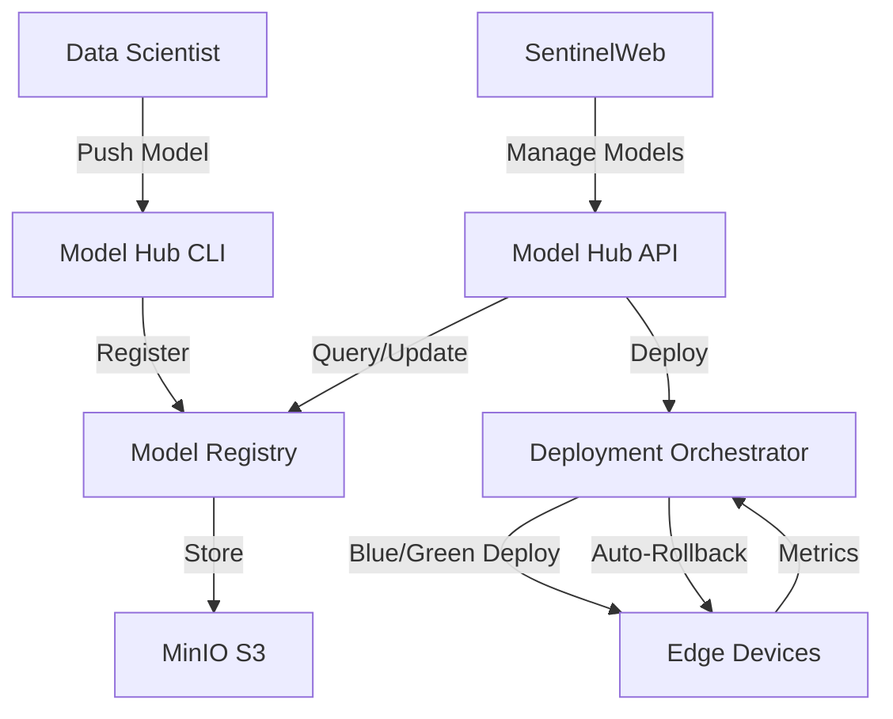

# Bulo.CloudSentinel Model Hub

The Model Hub is a microservice for versioned model management in Bulo.CloudSentinel. It provides a centralized registry for storing, tagging, and deploying vision models with support for blue/green deployments and automatic rollback on degradation.

## Architecture

The Model Hub consists of several components:

1. **Model Registry**: MLflow-based registry for storing and versioning models
2. **API Service**: FastAPI service for model management
3. **Deployment Orchestrator**: Kubernetes-based orchestrator for blue/green deployments
4. **CLI & UI**: Command-line and web interfaces for model management



## Model Registry

The Model Registry is built on MLflow, a popular open-source platform for managing the ML lifecycle. It provides:

- **Model Storage**: Store model artifacts in MinIO S3
- **Versioning**: Track model versions and changes
- **Metadata**: Store model metadata such as accuracy, size, and hardware compatibility
- **Lineage**: Track model lineage and dependencies

## API Service

The API Service is built with FastAPI and provides:

- **CRUD Operations**: Create, read, update, and delete models
- **Deployment Management**: Deploy models to different environments
- **gRPC Stream**: Stream model updates to edge devices
- **Security**: Authentication, authorization, and model verification

## Deployment Orchestrator

The Deployment Orchestrator manages model deployments using:

- **Blue/Green Deployments**: Deploy new models alongside existing ones
- **Canary Deployments**: Gradually roll out new models
- **Automatic Rollback**: Roll back to previous versions if performance degrades
- **Metrics Collection**: Collect performance metrics such as FPS and mAP

## CLI & UI

The Model Hub provides both a command-line interface and a web interface:

- **CLI**: Push, list, deploy, and roll back models
- **UI**: Manage models through SentinelWeb

## Security

The Model Hub implements several security features:

- **Model Signing**: All models are signed using cosign
- **Hash Verification**: Model hash is verified before loading
- **Seccomp Confinement**: Models run in a seccomp-confined runtime
- **Access Control**: Role-based access control for model management

## Usage

### CLI Usage

```bash
# Push a model to the registry
sentinel model push path/to/model.pt --name yolov10 --version 1.0.0 --model-type yolo --framework pytorch --stage staging

# List all models
sentinel model list

# Deploy a model
sentinel model deploy <model_id> --environment production --deployment-type blue-green

# Rollback a deployment
sentinel model rollback <deployment_id>
```

### API Usage

```python
import requests

# Push a model
with open("model.pt", "rb") as f:
    files = {"file": f}
    data = {
        "name": "yolov10",
        "version": "1.0.0",
        "model_type": "yolo",
        "framework": "pytorch",
        "stage": "staging",
    }
    response = requests.post("http://model-hub-api:8070/api/v1/models", files=files, data=data)
    model = response.json()

# Deploy a model
data = {
    "model_id": model["id"],
    "environment": "production",
    "deployment_type": "blue-green",
    "target": "all",
}
response = requests.post("http://model-hub-api:8070/api/v1/deployments", json=data)
deployment = response.json()
```

## Integration with Edge Kit

The Model Hub integrates with the Edge Kit to provide over-the-air updates to edge devices:

1. Edge devices subscribe to the gRPC stream for model updates
2. When a new model is deployed, the Edge Kit receives a notification
3. The Edge Kit downloads the new model and verifies its hash
4. The model is loaded in a blue/green deployment
5. If performance metrics degrade, the Edge Kit automatically rolls back to the previous version

## Example GitHub Action

Here's an example GitHub Action for automatically uploading a nightly retrained model:

```yaml
name: Upload Nightly Model

on:
  schedule:
    - cron: '0 0 * * *'  # Run at midnight every day

jobs:
  upload-model:
    runs-on: ubuntu-latest
    steps:
      - name: Checkout code
        uses: actions/checkout@v3

      - name: Set up Python
        uses: actions/setup-python@v4
        with:
          python-version: '3.10'

      - name: Install dependencies
        run: |
          python -m pip install --upgrade pip
          pip install -r requirements.txt
          pip install requests

      - name: Download latest model
        run: |
          # Download the latest model from your model storage
          # This is a placeholder for your actual download logic
          curl -o model.pt https://your-model-storage/latest-model.pt

      - name: Push model to Model Hub
        run: |
          python -c "
          import requests
          import os
          
          # Push model
          with open('model.pt', 'rb') as f:
              files = {'file': f}
              data = {
                  'name': 'yolov10',
                  'version': '$(date +%Y%m%d)',
                  'model_type': 'yolo',
                  'framework': 'pytorch',
                  'stage': 'staging',
              }
              response = requests.post(
                  'http://model-hub-api:8070/api/v1/models',
                  files=files,
                  data=data,
                  headers={'Authorization': 'Bearer ${{ secrets.MODEL_HUB_TOKEN }}'}
              )
              response.raise_for_status()
              model = response.json()
              print(f'Model pushed: {model[\"id\"]}')
          "
```

## Performance Considerations

When deploying models, consider the following performance metrics:

- **FPS (Frames Per Second)**: Higher is better
- **mAP (Mean Average Precision)**: Higher is better
- **Latency**: Lower is better
- **Memory Usage**: Lower is better

The Model Hub automatically collects these metrics and uses them to determine whether to roll back a deployment.

## Best Practices

1. **Version Your Models**: Use semantic versioning for your models
2. **Test Before Deployment**: Test models in staging before deploying to production
3. **Monitor Performance**: Monitor model performance after deployment
4. **Use Blue/Green Deployments**: Use blue/green deployments for zero-downtime updates
5. **Enable Auto-Rollback**: Enable automatic rollback to quickly recover from issues
6. **Sign Your Models**: Sign your models to ensure integrity
7. **Document Your Models**: Document model inputs, outputs, and performance characteristics
